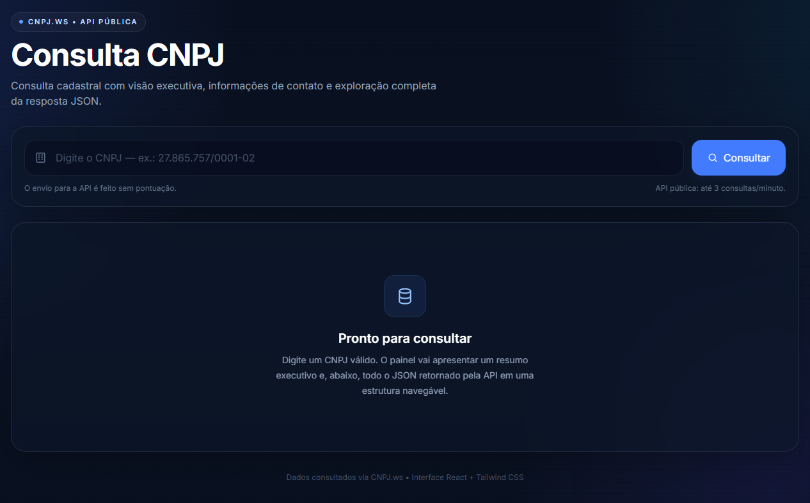

# Consulta CNPJ — React + Tailwind

Aplicação web moderna para consulta e visualização de dados cadastrais de empresas a partir da API pública do [CNPJ.ws](https://publica.cnpj.ws/).

O projeto foi desenvolvido com foco em **experiência de usuário, responsividade e flexibilidade de dados**, evitando depender de um schema rígido da API. Além de apresentar um resumo executivo dos principais dados da empresa, a aplicação possui um **renderer recursivo de JSON** capaz de exibir automaticamente objetos, arrays e listas de objetos que possam surgir na resposta da API.

> Projeto desenvolvido como peça de portfólio para demonstrar frontend moderno, integração com API REST, tratamento de estados e renderização dinâmica de dados.

---

## Preview



---

## Funcionalidades

### Consulta de CNPJ

- Campo com máscara automática de CNPJ.
- Aceita entrada com ou sem pontuação.
- Validação do CNPJ antes da chamada à API.
- Botão de consulta com estado de carregamento.
- Tratamento visual de erros.
- Feedback para consultas inválidas ou sem resultado.

### Resumo empresarial

Após a consulta, os dados principais são apresentados em uma interface organizada e de leitura rápida:

- Razão social.
- Nome fantasia.
- Situação cadastral.
- CNPJ formatado.
- Endereço.
- Cidade e UF.
- CEP.
- CNAE.
- Telefone.
- E-mail.
- Inscrições estaduais.
- Capital social.

### Renderização dinâmica do JSON

Um dos pontos centrais do projeto é o **visualizador genérico dos dados retornados pela API**.

Em vez de codificar manualmente todos os campos possíveis, a aplicação percorre a resposta de forma recursiva e identifica automaticamente:

- strings;
- números;
- booleanos;
- objetos;
- arrays;
- arrays contendo objetos;
- estruturas aninhadas em múltiplos níveis.

Isso permite que novos campos adicionados ou retornados pela API possam ser exibidos sem necessidade de alterar o componente de interface.

### JSON bruto

A interface também disponibiliza:

- visualização do JSON completo;
- formatação `JSON.stringify(..., null, 2)`;
- cópia do JSON para o clipboard;
- exibição independente do resumo executivo.

### Formatação automática

Os valores são formatados conforme seu tipo ou contexto:

- CNPJ → `00.000.000/0000-00`
- CEP → `00000-000`
- Datas → formato amigável para leitura
- Booleanos → representação textual
- Capital social → moeda brasileira
- Números e valores → apresentação amigável

### Responsividade

O layout foi pensado para funcionar em:

- desktop;
- notebook;
- tablet;
- smartphone.

A interface reorganiza cards, tabelas e blocos de dados conforme a largura disponível.

---

## Stack

| Tecnologia | Utilização |
|---|---|
| React | Construção da interface |
| Vite | Tooling e desenvolvimento |
| Tailwind CSS | Estilização e layout responsivo |
| JavaScript | Lógica da aplicação |
| Fetch API | Comunicação com a API REST |
| Clipboard API | Cópia do JSON |
| SVG inline | Ícones sem dependência externa |

---

## Arquitetura

O projeto foi pensado para manter a interface simples e, ao mesmo tempo, permitir evolução futura.

### Fluxo da aplicação

```text
Usuário
   │
   ▼
Campo CNPJ
   │
   ├── Máscara
   ├── Validação
   │
   ▼
Consulta REST
   │
   ▼
API pública CNPJ.ws
   │
   ▼
JSON
   │
   ├───────────────┐
   ▼               ▼
Resumo        Renderer recursivo
empresarial         │
   │                ├── Objetos
   │                ├── Arrays
   │                └── Arrays de objetos
   │
   └───────────────┬
                   ▼
             Visualização
```

---

## Destaques técnicos

### 1. Renderer recursivo

O visualizador de dados não depende de uma estrutura fixa.

Conceitualmente, a renderização segue esta lógica:

```js
if (valor é objeto) {
  renderizar propriedades recursivamente
}

if (valor é array) {
  renderizar cada item recursivamente
}

if (valor é valor simples) {
  formatar e exibir
}
```

Esse padrão é útil em cenários onde:

- a API possui estruturas extensas;
- os campos retornados podem variar;
- existem objetos aninhados;
- arrays podem conter diferentes tipos de dados.

### 2. Separação entre dado bruto e apresentação

A resposta original da API permanece disponível para:

- resumo;
- renderer dinâmico;
- inspeção do JSON;
- cópia para clipboard.

Isso reduz acoplamento entre a camada de consulta e a camada de apresentação.

### 3. Estados da interface

A aplicação trata explicitamente diferentes estados:

```text
Inicial
   ↓
Digitando CNPJ
   ↓
Consultando
   ↓
┌───────────────┬─────────────────┐
▼               ▼                 ▼
Sucesso        Erro            Sem resultado
```

O estado de loading impede uma experiência de interface ambígua durante a requisição.

### 4. Sem biblioteca externa de ícones

Os ícones utilizados são construídos com SVG inline, reduzindo dependências e mantendo:

- bundle mais enxuto;
- controle visual;
- facilidade de customização;
- menor acoplamento com bibliotecas de terceiros.

---

## API utilizada

Endpoint:

```text
GET https://publica.cnpj.ws/cnpj/{cnpj}
```

Exemplo:

```text
https://publica.cnpj.ws/cnpj/12345678000100
```

A aplicação envia o CNPJ sem pontuação.

---

## Como executar localmente

### Pré-requisitos

- Node.js
- npm

### Instalação

```bash
git clone https://github.com/SEU-USUARIO/consulta-cnpj-react.git
cd consulta-cnpj-react
npm install
```

### Desenvolvimento

```bash
npm run dev
```

O Vite disponibilizará a aplicação em um endereço local, normalmente:

```text
http://localhost:5173
```

### Build de produção

```bash
npm run build
```

### Testes

```bash
npm test
```

### Preview do build

```bash
npm run preview
```

---

## Estrutura do projeto

```text
consulta-cnpj-react/
├── public/
├── src/
│   ├── index.css
│   └── main.jsx
├── index.html
├── package.json
├── vite.config.js
├── README.md
└── .gitignore
```

---

## Possíveis evoluções

A arquitetura permite evoluções sem necessidade de reescrever a aplicação.

Algumas possibilidades:

- histórico das consultas;
- favoritos;
- exportação para PDF;
- exportação para CSV;
- impressão do cadastro;
- compartilhamento de uma consulta;
- comparação entre empresas;
- filtros para grandes estruturas JSON;
- busca dentro do JSON;
- modo escuro;
- dashboard com indicadores cadastrais;
- persistência local utilizando `localStorage`;
- camada backend própria para cache e controle de consumo da API;
- autenticação para transformar o frontend em uma aplicação corporativa.

---

## Objetivo do projeto

Este projeto demonstra, na prática, conhecimentos em:

- desenvolvimento frontend com React;
- construção de interfaces responsivas;
- integração com APIs REST;
- consumo e tratamento de JSON;
- validação e formatação de dados;
- gerenciamento de estados de interface;
- tratamento de erros;
- componentes reutilizáveis;
- renderização recursiva;
- preocupação com experiência do usuário;
- criação de aplicações sem dependências desnecessárias.

---

## Licença

Projeto para fins de estudo, demonstração técnica e portfólio.

A API utilizada é disponibilizada pelo CNPJ.ws e possui suas próprias condições de uso.

---

## Autor

**Luis Fernando Kalfels**

FullStack PHP/JS/MySQL • Infraestrutura de TI • Sistemas Corporativos • Segurança de TI

[LinkedIn](https://www.linkedin.com/in/kalfels/) • [GitHub](https://github.com/kalfels) • [Bitserv](https://bitserv.com.br/)
